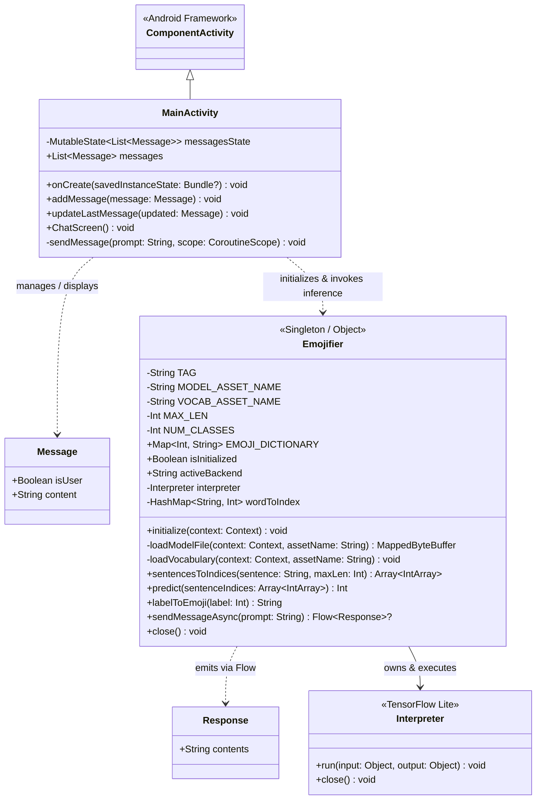
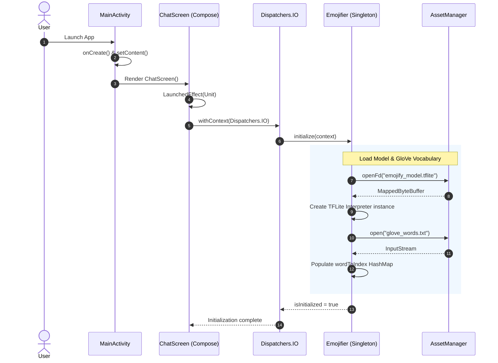
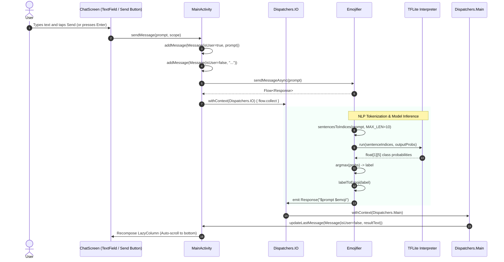
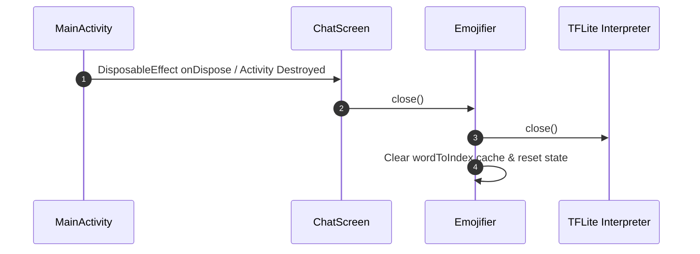

# Emojifier Android Application

An Android application built with **Jetpack Compose** and **TensorFlow Lite (TFLite)** that accepts user text prompts, analyzes them using a GloVe-based NLP model, and appends an appropriate emoji prediction.

---

## 1. Class Diagram

---

## 2. Sequence Diagrams

### 2.1 Initialization Lifecycle

---

### 2.2 Message Input & Inference Flow

---

### 2.3 Cleanup / Teardown Lifecycle

---

## 3. Architecture & Key Components

| Component | Responsibility |
| :--- | :--- |
| **`MainActivity`** | Hosts the Jetpack Compose environment, holds chat state (`messagesState`), handles key events, and launches inference coroutines. |
| **`ChatScreen` / `MessageItem`** | Composable UI components displaying message bubbles in a `LazyColumn` with auto-scroll and a text entry field. |
| **`Emojifier`** | Singleton managing the TensorFlow Lite `Interpreter`, mapping words to GloVe embedding indices, performing tokenization, running inference, and mapping class labels to emojis (❤️, ⚾, 😄, 😞, 🍴). |
| **`Response` / `Message`** | Domain models representing user prompts and model responses. |
