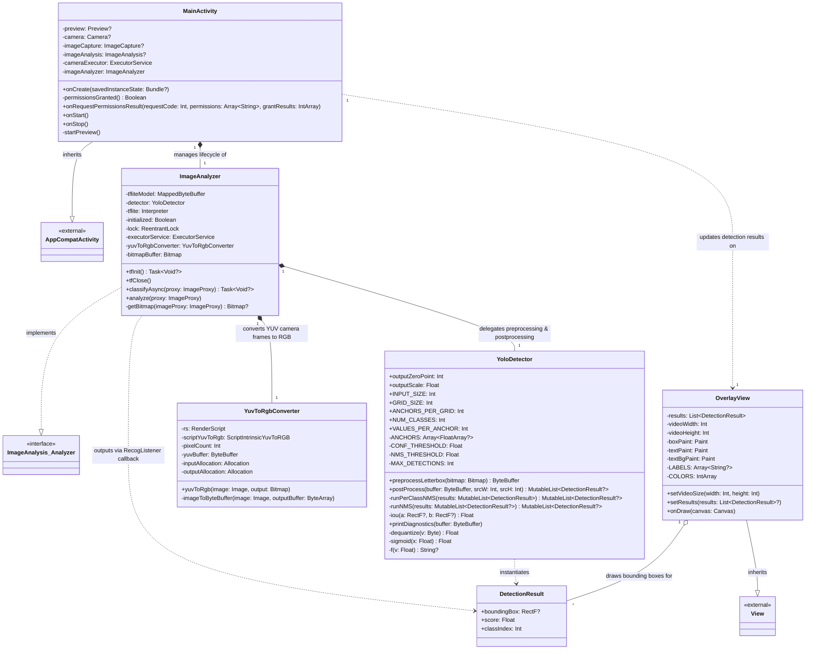
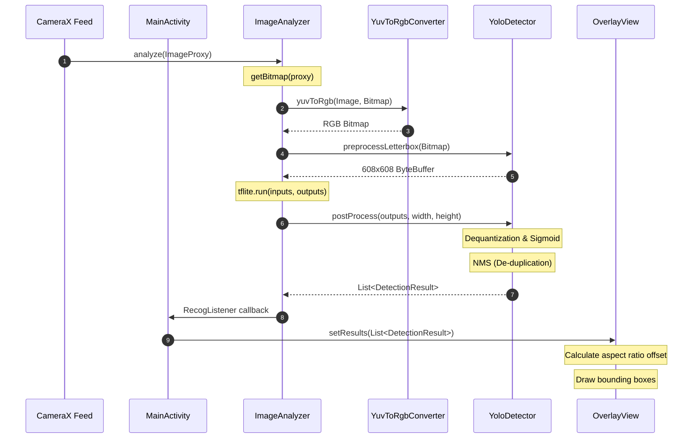

# Yolocam Class Diagrams and Architecture

This document provides a detailed UML class diagram and architectural breakdown of the **yolocam** Android application. Yolocam is a real-time object detection application that captures camera frames using CameraX, converts YUV frames to RGB, runs inference with a quantized TensorFlow Lite (TFLite) YOLOv2 model, and draws bounding boxes on a custom overlay view.

---

## 1. Class Diagram

The following Mermaid diagram represents the structure and relationships of the classes in the codebase.

---

## 2. Class Responsibilities and Key Details

### [MainActivity](file:///home/hdyoon/ex/yolocam/src/com/peyo/yolocam/MainActivity.kt)
*   **Responsibility**: Entry point of the application. Manages runtime camera permissions, sets up the CameraX preview pipeline, initializes UI components, and bridges the analyzer's output with the UI overlay.
*   **Key Fields**:
    *   `preview`, `camera`, `imageCapture`, `imageAnalysis`: CameraX configuration elements.
    *   `imageAnalyzer`: The custom analyzer handling neural net execution.
    *   `cameraExecutor`: A single-thread executor to run the image analysis asynchronously off the main thread.
*   **Key Methods**:
    *   `onCreate(...)`: Sets up initial view contents and triggers permissions checks.
    *   `onStart()` / `onStop()`: Initializes and closes the TensorFlow Lite interpreter inside `imageAnalyzer` in sync with activity lifecycle states.
    *   `startPreview()`: Configures CameraX and binds the `imageAnalyzer` to the camera feed.

### [ImageAnalyzer](file:///home/hdyoon/ex/yolocam/src/com/peyo/yolocam/ImageAnalyzer.kt)
*   **Responsibility**: Implements CameraX's `ImageAnalysis.Analyzer`. Coordinates image format conversion, model input preparation, TFLite inference execution, and post-processing.
*   **Key Fields**:
    *   `detector`: Local instance of `YoloDetector` for formatting inputs and outputs.
    *   `tflite`: The TensorFlow Lite `Interpreter` instance.
    *   `yuvToRgbConverter`: Helper class to convert YUV image frames into RGB Bitmaps.
    *   `listener`: A callback function type-aliased as `RecogListener` to send detection results back to `MainActivity` on completion.
*   **Key Methods**:
    *   `tfInit()`: Initializes the interpreter asynchronously using NNAPI acceleration if available.
    *   `tfClose()`: Safely shuts down the model interpreter and executor service.
    *   `analyze(proxy: ImageProxy)`: Receives camera frames and invokes `classifyAsync(proxy)` to analyze them.

### [YoloDetector](file:///home/hdyoon/ex/yolocam/src/com/peyo/yolocam/YoloDetector.kt)
*   **Responsibility**: Encapsulates YOLOv2 specific configurations (e.g. anchors, grid size, thresholds) and handles CPU-heavy pre-processing and post-processing mathematical operations.
*   **Key Fields**:
    *   `INPUT_SIZE` (608), `GRID_SIZE` (19), `ANCHORS_PER_GRID` (5), `NUM_CLASSES` (80): YOLOv2 network parameters.
    *   `CONF_THRESHOLD` (0.4f), `NMS_THRESHOLD` (0.4f): Threshold constants for filtering low-confidence detections and overlapping bounding boxes.
*   **Key Methods**:
    *   `preprocessLetterbox(bitmap: Bitmap)`: Resizes the bitmap to 608x608, preserving the aspect ratio by adding a gray border (letterbox padding).
    *   `postProcess(...)`: Decodes the raw output tensor (which is in quantized int8 format) to original coordinates, then applies Non-Maximum Suppression (NMS).
    *   `runPerClassNMS(...)`: Filters out duplicate overlapping boxes independently for each detected object category.

### [DetectionResult](file:///home/hdyoon/ex/yolocam/src/com/peyo/yolocam/DetectionResult.kt)
*   **Responsibility**: A simple data class representing a single detected object box.
*   **Key Fields**:
    *   `boundingBox`: A `RectF?` object holding normalized coordinates (0.0 to 1.0) of the detection box relative to the original image frame.
    *   `score`: The confidence score (probability) of the detection.
    *   `classIndex`: The category index (referencing COCO classes).

### [YuvToRgbConverter](file:///home/hdyoon/ex/yolocam/src/com/peyo/yolocam/YuvToRgbConverter.kt)
*   **Responsibility**: Uses RenderScript to convert the CameraX camera feed frames (`YUV_420_888` format) into an ARGB `Bitmap` efficiently.
*   **Key Fields**:
    *   `rs`: RenderScript context.
    *   `scriptYuvToRgb`: Intrinsic script for performing the color space translation.
*   **Key Methods**:
    *   `yuvToRgb(image: Image, output: Bitmap)`: Main entry point for performing color conversion.
    *   `imageToByteBuffer(...)`: Low-level pixel extraction and interleaving to match the NV21 format.

### [OverlayView](file:///home/hdyoon/ex/yolocam/src/com/peyo/yolocam/OverlayView.kt)
*   **Responsibility**: Custom UI `View` positioned on top of the CameraX finder. It scales and renders bounding box rectangles and class labels.
*   **Key Fields**:
    *   `results`: List of `DetectionResult` objects to draw.
    *   `videoWidth` / `videoHeight`: Dimensions of the video stream (used to calculate scale offsets).
    *   `LABELS`: Array of 80 COCO category names.
*   **Key Methods**:
    *   `setVideoSize(...)` / `setResults(...)`: Updates state parameters and calls `invalidate()` to trigger a redraw.
    *   `onDraw(canvas: Canvas)`: Calculates viewport letterbox/pillarbox offsets to scale normalized box coordinates to match the aspect ratio of the video output, then draws the elements onto the Canvas.

---

## 3. Real-Time Data Flow

The sequence of operations across these classes is as follows:

